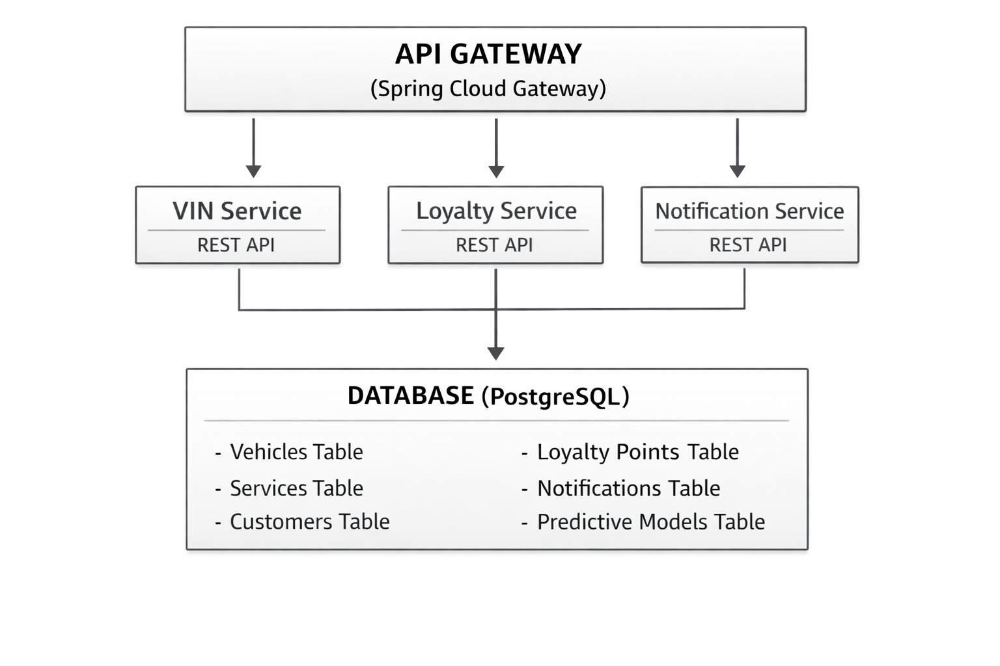
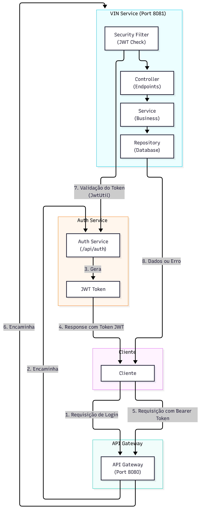

# Sprint 3 - SOA e Web Services

----

# Ford VIN Share System - Sistema de Fidelidade e Pós-Venda

## Integrantes do Grupo
- **Matheus Taylor** (RM556211)
- **Henrique Maldonado** (RM557270)
- **Yuri Silveira** (RM557475)
- **Igor Soos** (RM556010)

## Visão Geral do Projeto

Este projeto implementa um **sistema de fidelidade** para concessionárias Ford na América do Sul, focado em aumentar o **VIN Share** (porcentagem de veículos Ford que utilizam a rede oficial para manutenções).

### Funcionalidades Principais

1. **Cadastro de Veículo por VIN**: Identificação automática do ano, modelo e especificações do veículo
2. **Sistema de Fidelidade**: Benefícios progressivos baseados no histórico de serviços
3. **Notificações Inteligentes**: Lembretes de revisão, ofertas personalizadas e manutenção da garantia
4. **Dashboard Analítico**: Visualização de dados para concessionárias
5. **Modelo Preditivo**: Identificação de veículos em risco de churn e geração de leads proativos
6. **Autenticação e Autorização JWT**: Controle de acesso baseado em tokens com diferentes perfis de usuário

## Arquitetura do Sistema (Diagrama)



### Diagrama de Autenticação e Fluxo de Comunicação




## Estrutura de Serviços

### 1. VIN Service (`vin-service`)
- **Responsabilidade**: Gerenciar informações de veículos via VIN
- **Endpoints**:
  - `GET /api/vin/{vin}`: Buscar informações do veículo
  - `POST /api/vin`: Cadastrar novo veículo
  - `PUT /api/vin/{vin}`: Atualizar informações do veículo

### 2. Loyalty Service (`loyalty-service`)
- **Responsabilidade**: Gerenciar programa de fidelidade e benefícios
- **Endpoints**:
  - `GET /api/loyalty/{customerId}`: Buscar status de fidelidade
  - `POST /api/loyalty/points`: Adicionar pontos de fidelidade
  - `GET /api/loyalty/benefits/{tier}`: Listar benefícios por nível

### 3. Notification Service (`notification-service`)
- **Responsabilidade**: Gerenciar comunicações com clientes
- **Endpoints**:
  - `POST /api/notifications/send`: Enviar notificação
  - `GET /api/notifications/preferences/{customerId}`: Preferências de notificação
  - `PUT /api/notifications/preferences`: Atualizar preferências

### 4. API Gateway (`api-gateway`)
- **Responsabilidade**: Roteamento, autenticação e rate limiting
- **Tecnologia**: Spring Cloud Gateway

## Tecnologias Utilizadas

- **Linguagem**: Java 17+
- **Framework**: Spring Boot 3.x
- **Banco de Dados**: PostgreSQL
- **Migrações**: Flyway
- **Documentação**: Swagger/OpenAPI 3.0
- **Comunicação**: RESTful APIs (JSON)
- **Build Tool**: Maven

## Padrões e Boas Práticas

- **SOA (Service-Oriented Architecture)**: Serviços independentes e reutilizáveis
- **REST**: Métodos HTTP adequados (GET, POST, PUT, DELETE)
- **JSON**: Formato padrão para troca de dados
- **Tratamento de Erros**: Exceções padronizadas com códigos HTTP apropriados
- **Validação**: Validação de entrada em todas as camadas

## Como Executar

### Pré-requisitos
- Java 17+
- Maven 3.8+
- PostgreSQL 14+
- Docker (opcional, para containerização)

### Configuração do Banco de Dados

```sql
CREATE DATABASE ford_vin_share;
CREATE USER ford_user WITH PASSWORD 'ford_password';
GRANT ALL PRIVILEGES ON DATABASE ford_vin_share TO ford_user;
```

### Executando os Serviços

```bash
# VIN Service
cd vin-service
mvn spring-boot:run

# Loyalty Service
cd loyalty-service
mvn spring-boot:run

# Notification Service
cd notification-service
mvn spring-boot:run

# API Gateway
cd api-gateway
mvn spring-boot:run
```

## Documentação da API

Após iniciar os serviços, a documentação Swagger estará disponível em:
- VIN Service: `http://localhost:8081/swagger-ui.html`
- Loyalty Service: `http://localhost:8082/swagger-ui.html`
- Notification Service: `http://localhost:8083/swagger-ui.html`
- API Gateway: `http://localhost:8080/swagger-ui.html`

## Modelo de Dados

### Tabela: Vehicles
```sql
CREATE TABLE vehicles (
    id BIGSERIAL PRIMARY KEY,
    vin VARCHAR(17) UNIQUE NOT NULL,
    customer_id BIGINT NOT NULL,
    make VARCHAR(50),
    model VARCHAR(50),
    year INTEGER,
    mileage INTEGER,
    last_service_date DATE,
    next_service_date DATE,
    warranty_status VARCHAR(20),
    created_at TIMESTAMP DEFAULT CURRENT_TIMESTAMP,
    updated_at TIMESTAMP DEFAULT CURRENT_TIMESTAMP
);
```

### Tabela: Loyalty_Programs
```sql
CREATE TABLE loyalty_programs (
    id BIGSERIAL PRIMARY KEY,
    customer_id BIGINT UNIQUE NOT NULL,
    points INTEGER DEFAULT 0,
    tier VARCHAR(20) DEFAULT 'BRONZE',
    total_services INTEGER DEFAULT 0,
    total_spent DECIMAL(10,2) DEFAULT 0.00,
    created_at TIMESTAMP DEFAULT CURRENT_TIMESTAMP,
    updated_at TIMESTAMP DEFAULT CURRENT_TIMESTAMP
);
```

### Tabela: Notifications
```sql
CREATE TABLE notifications (
    id BIGSERIAL PRIMARY KEY,
    customer_id BIGINT NOT NULL,
    vehicle_id BIGINT NOT NULL,
    type VARCHAR(50),
    message TEXT,
    status VARCHAR(20) DEFAULT 'PENDING',
    scheduled_date TIMESTAMP,
    sent_date TIMESTAMP,
    created_at TIMESTAMP DEFAULT CURRENT_TIMESTAMP
);
```

## Integração com IA para Análise Preditiva

O sistema utiliza modelos preditivos para:
1. **Identificar veículos com alta probabilidade de necessitar serviço**
2. **Detectar clientes em risco de abandonar a rede oficial**
3. **Recomendar ofertas personalizadas baseadas no histórico**

## Métricas de Sucesso (VIN Share)

- Aumento na porcentagem de veículos Ford utilizando rede oficial
- Redução do churn de clientes
- Aumento na frequência de agendamentos de serviço
- Melhoria na satisfação do cliente (NPS)

## Licença

Este projeto está sob a licença MIT.
